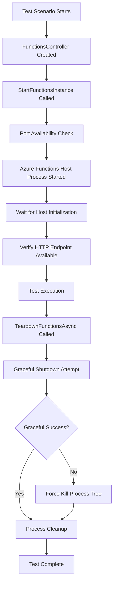

# Corvus.Testing.AzureFunctions.ReqnRoll

A comprehensive testing framework for Azure Functions that integrates with ReqnRoll (formerly SpecFlow) to enable behaviour-driven development (BDD) testing of Azure Functions projects. This library provides utilities to programmatically start, manage, and tear down Azure Functions instances during testing scenarios.

## Table of Contents

- [Overview](#overview)
- [Architecture](#architecture)
- [Core Components](#core-components)
- [Getting Started](#getting-started)
- [Usage Patterns](#usage-patterns)
- [Configuration](#configuration)
- [Examples](#examples)
- [Recommended Practices](#recommended-practices)
- [Troubleshooting](#troubleshooting)

## Overview

This library provides two main packages:

1. **Corvus.Testing.AzureFunctions** - Core functionality for starting and managing Azure Functions instances
2. **Corvus.Testing.AzureFunctions.ReqnRoll** - ReqnRoll integration for BDD testing scenarios

### Key Features

- ✅ Programmatically start and stop Azure Functions instances
- ✅ Support for both In-Process and Isolated Azure Functions models
- ✅ ReqnRoll integration with step definitions and hooks
- ✅ Port management and conflict resolution
- ✅ Environment variable configuration
- ✅ Process output capture and logging
- ✅ Graceful shutdown with fallback force termination
- ✅ Cross-platform support (Windows, macOS, Linux)

## Architecture

### Core Components

#### FunctionsController

The [`FunctionsController`](Solutions/Corvus.Testing.AzureFunctions/Corvus/Testing/AzureFunctions/FunctionsController.cs) is the primary class for managing Azure Functions instances:

```csharp
public sealed class FunctionsController
{
    public FunctionsController(ILogger logger)

    public async Task StartFunctionsInstanceAsync(string path, int port, string runtime, string provider = "csharp", FunctionConfiguration? configuration = null)
    
    public async Task TeardownFunctionsAsync(CancellationToken cancellationToken = default)
    
    public IEnumerable<IProcessOutput> GetFunctionsOutput()
}
```

**Key Responsibilities:**
- Launch Azure Functions host processes
- Manage multiple function instances simultaneously
- Monitor process startup and health
- Handle graceful and forceful shutdown
- Capture and provide access to process output

#### FunctionConfiguration

The [`FunctionConfiguration`](Solutions/Corvus.Testing.AzureFunctions/Corvus/Testing/AzureFunctions/FunctionConfiguration.cs) class manages environment variables:

```csharp
public class FunctionConfiguration
{
    public Dictionary<string, string> EnvironmentVariables { get; }
}
```

#### FunctionsBindings (ReqnRoll Integration)

The [`FunctionsBindings`](Solutions/Corvus.Testing.AzureFunctions.ReqnRoll/Corvus/Testing/AzureFunctions/ReqnRoll/FunctionsBindings.cs) class provides ReqnRoll step definitions and context management:

```csharp
[Binding]
public class FunctionsBindings
{
    [Given(@"I start a functions instance for the local project '([^']*)' on port (\d*)")]
    public Task StartAFunctionsInstance(string path, int port)

    [AfterScenario]
    public async Task TeardownFunctionsAfterScenario()
}
```

### Process Flow



## Getting Started

### Prerequisites

- .NET 8.0 or later
- Azure Functions Core Tools
- Visual Studio or VS Code with C# extension

### Installation

Install the NuGet packages:

```bash
# Core functionality
dotnet add package Corvus.Testing.AzureFunctions

# ReqnRoll integration
dotnet add package Corvus.Testing.AzureFunctions.ReqnRoll
```

### Basic Setup

1. **Create a Functions Controller:**

```csharp
using Microsoft.Extensions.Logging;
using Corvus.Testing.AzureFunctions;

var loggerFactory = LoggerFactory.Create(builder => builder.AddConsole());
var logger = loggerFactory.CreateLogger<FunctionsController>();
FunctionsController controller = new(logger);
```

2. **Start a Functions Instance:**

```csharp
await controller.StartFunctionsInstanceAsync(
    path: "MyFunctionApp",           // Function project path
    port: 7071,                      // Port to run on
    runtime: "net8.0"               // Runtime version
);
```

3. **Cleanup:**

```csharp
await controller.TeardownFunctionsAsync();
```

## Usage Patterns

### Pattern 1: Per-Test Instance

Start and stop functions for each individual test:

```csharp
[Test]
public async Task TestMyFunction()
{
    FunctionsController controller = new(logger);

    try
    {
        await controller.StartFunctionsInstanceAsync("MyFunctionApp", 7071, "net8.0");

        // Perform your tests
        using HttpClient client = new();
        var response = await client.GetAsync("http://localhost:7071/api/MyFunction");
        
        Assert.AreEqual(HttpStatusCode.OK, response.StatusCode);
    }
    finally
    {
        await controller.TeardownFunctionsAsync();
    }
}
```

### Pattern 2: Per-Feature Instance (ReqnRoll)

Use ReqnRoll hooks to manage function lifecycles:

```csharp
[Binding]
public static class FunctionHooks
{
    [BeforeFeature("myFeature")]
    public static Task StartFunctions(FeatureContext featureContext)
    {
        var controller = FunctionsBindings.GetFunctionsController(featureContext);
        return controller.StartFunctionsInstanceAsync("MyFunctionApp", 7071, "net8.0");
    }

    [AfterFeature("myFeature")]
    public static async Task StopFunctions(FeatureContext featureContext)
    {
        var controller = FunctionsBindings.GetFunctionsController(featureContext);
        await controller.TeardownFunctionsAsync();
    }
}
```

### Pattern 3: Multiple Function Apps

Run multiple function apps simultaneously:

```csharp
FunctionsController controller = new(logger);

// Start multiple functions on different ports
await Task.WhenAll(
    controller.StartFunctionsInstanceAsync("ApiGateway", 7071, "net8.0"),
    controller.StartFunctionsInstanceAsync("OrderService", 7072, "net8.0"),
    controller.StartFunctionsInstanceAsync("PaymentService", 7073, "net8.0")
);

// All functions are now running and ready for integration testing
```

## Configuration

### Environment Variables

Configure your functions using [`FunctionConfiguration`](Solutions/Corvus.Testing.AzureFunctions/Corvus/Testing/AzureFunctions/FunctionConfiguration.cs):

```csharp
FunctionConfiguration config = new();
config.EnvironmentVariables["CosmosDB:ConnectionString"] = "AccountEndpoint=...";
config.EnvironmentVariables["ServiceBus:ConnectionString"] = "Endpoint=...";
config.EnvironmentVariables["ApplicationInsights:InstrumentationKey"] = "test-key";

await controller.StartFunctionsInstanceAsync("MyApp", 7071, "net8.0", configuration: config);
```

### ReqnRoll Configuration

Configure ReqnRoll settings in your test project:

```json
// reqnroll.json
{
  "framework": {
    "assemblyName": "Microsoft.VisualStudio.TestPlatform.TestFramework"
  },
  "generator": {
    "allowDebugGeneratedFiles": true
  }
}
```

## Examples

### Example 1: Basic HTTP Function Test

**Function Code:**
```csharp
[FunctionName("Hello")]
public static async Task<IActionResult> Run(
    [HttpTrigger(AuthorizationLevel.Anonymous, "get", Route = null)] HttpRequest req,
    ILogger log)
{
    string name = req.Query["name"];
    return new OkObjectResult($"Hello, {name}!");
}
```

**Test Code:**
```csharp
[Test]
public async Task HelloFunction_ReturnsGreeting()
{
    FunctionsController controller = new(logger);
    await controller.StartFunctionsInstanceAsync("HelloApp", 7071, "net8.0");

    try
    {
        using HttpClient client = new();
        var response = await client.GetAsync("http://localhost:7071/api/Hello?name=World");
        var content = await response.Content.ReadAsStringAsync();
        
        Assert.AreEqual(HttpStatusCode.OK, response.StatusCode);
        Assert.AreEqual("Hello, World!", content);
    }
    finally
    {
        await controller.TeardownFunctionsAsync();
    }
}
```

### Example 2: ReqnRoll Feature Test

**Feature File:**
```gherkin
@functionsTest
Feature: Hello Function
    As a user
    I want to call the Hello function
    So that I receive a personalized greeting

Scenario: Get personalized greeting
    Given I start a functions instance for the local project 'HelloApp' on port 7071
    When I send a GET request to 'http://localhost:7071/api/Hello?name=Alice'
    Then I receive a 200 response code
    And the response body contains the text 'Hello, Alice!'
```

**Step Definitions:**
```csharp
[Binding]
public class HelloSteps
{
    private readonly ScenarioContext scenarioContext;
    private HttpResponseMessage? lastResponse;

    public HelloSteps(ScenarioContext scenarioContext)
    {
        this.scenarioContext = scenarioContext;
    }

    [When(@"I send a GET request to '([^']*)'")]
    public async Task WhenISendAGetRequestTo(string url)
    {
        using HttpClient client = new();
        this.lastResponse = await client.GetAsync(url);
    }

    [Then(@"I receive a (\d+) response code")]
    public void ThenIReceiveAResponseCode(int expectedStatusCode)
    {
        Assert.AreEqual(expectedStatusCode, (int)this.lastResponse!.StatusCode);
    }

    [Then(@"the response body contains the text '([^']*)'")]
    public async Task ThenTheResponseBodyContainsTheText(string expectedText)
    {
        string content = await this.lastResponse!.Content.ReadAsStringAsync();
        Assert.IsTrue(content.Contains(expectedText));
    }
}
```

### Example 3: Configuration-Based Testing

**Hook Implementation:**
```csharp
[Binding]
public static class ConfiguredFunctionHooks
{
    [BeforeFeature("requiresConfig")]
    public static Task StartConfiguredFunction(FeatureContext featureContext)
    {
        var controller = FunctionsBindings.GetFunctionsController(featureContext);
        var config = FunctionsBindings.GetFunctionConfiguration(featureContext);
        
        // Set up test-specific configuration
        config.EnvironmentVariables["Database:ConnectionString"] = "Server=localhost;Database=TestDB;";
        config.EnvironmentVariables["ExternalApi:BaseUrl"] = "https://test-api.example.com";
        config.EnvironmentVariables["Feature:EnableNewFeature"] = "true";

        return controller.StartFunctionsInstanceAsync("ConfigurableApp", 7074, "net8.0", configuration: config);
    }
}
```

## Recommended Practices

### 1. Port Management
- Use different ports for different test classes/features to avoid conflicts
- Consider using [`PortFinder`](Solutions/Corvus.Testing.AzureFunctions/Corvus/Testing/AzureFunctions/PortFinder.cs) for dynamic port allocation
- Common port ranges: 7071-7099 for Azure Functions testing

### 2. Lifecycle Management
- Always ensure functions are torn down after tests
- Use try-finally or using statements for guaranteed cleanup
- Consider per-feature hooks for better performance in ReqnRoll scenarios

### 3. Logging
- Capture function output for debugging: `controller.GetFunctionsOutput()`
- Use structured logging with correlation IDs
- Log function startup and shutdown events

### 4. Configuration
- Use separate configuration for different test environments
- Avoid hardcoding connection strings - use test doubles or local resources
- Consider using configuration builders for complex scenarios

### 5. Performance
- Reuse function instances across related tests when possible
- Start multiple functions in parallel using `Task.WhenAll()`
- Monitor startup times and optimize if needed

## Troubleshooting

### Common Issues

#### 1. Port Already in Use
```
FunctionStartupException: Port 7071 is already in use
```
**Solution:** Use different ports or implement dynamic port allocation

#### 2. Function Startup Timeout
```
FunctionStartupException: Timed out while starting functions instance
```
**Solutions:**
- Check function project compilation errors
- Verify all dependencies are available
- Increase startup timeout if needed
- Check process output for detailed error messages

#### 3. Process Won't Terminate
```
InvalidOperationException: Function host process could not be terminated
```
**Solutions:**
- Check for resource locks (file handles, database connections)
- Verify graceful shutdown implementation in functions
- Check system process limits

#### 4. Missing Azure Functions Core Tools
```
Win32Exception: The system cannot find the file specified
```
**Solution:** Install Azure Functions Core Tools:
```bash
npm install -g azure-functions-core-tools@4 --unsafe-perm true
```

### Debugging Tips

1. **Enable Detailed Logging:**
```csharp
var loggerFactory = LoggerFactory.Create(builder => 
    builder.AddConsole().SetMinimumLevel(LogLevel.Debug));
```

2. **Capture Process Output:**
```csharp
var output = controller.GetFunctionsOutput();
foreach (var processOutput in output)
{
    Console.WriteLine($"StdOut: {processOutput.StandardOutputText}");
    Console.WriteLine($"StdErr: {processOutput.StandardErrorText}");
}
```

3. **Manual Testing:**
Verify your function works standalone before adding to tests:
```bash
cd MyFunctionApp
func start --port 7071
```

## Project Structure

```
Corvus.Testing.AzureFunctions.ReqnRoll/
├── Solutions/
│   ├── Corvus.Testing.AzureFunctions/              # Core library
│   │   └── Corvus/Testing/AzureFunctions/
│   │       ├── FunctionsController.cs              # Main controller class
│   │       ├── FunctionConfiguration.cs            # Configuration management
│   │       ├── FunctionProject.cs                  # Project path resolution
│   │       ├── PortFinder.cs                       # Port management utilities
│   │       └── Internal/                           # Internal implementation details
│   ├── Corvus.Testing.AzureFunctions.ReqnRoll/    # ReqnRoll integration
│   │   └── Corvus/Testing/AzureFunctions/ReqnRoll/
│   │       └── FunctionsBindings.cs                # ReqnRoll step definitions
│   ├── *.Demo.InProcess/                           # In-process function examples
│   ├── *.Demo.Isolated/                            # Isolated function examples
│   └── *.Demo/                                     # ReqnRoll test examples
├── README.md
└── DOCUMENTATION.md                                 # This file
```

## Contributing

When contributing to this project:

1. Follow the existing code style and patterns
2. Add unit tests for new functionality
3. Update documentation for public APIs
4. Ensure cross-platform compatibility
5. Test with both In-Process and Isolated Azure Functions models

## License

This project is licensed under the Apache 2.0 License. See the LICENSE file for details.

---

*This documentation was generated for Corvus.Testing.AzureFunctions.ReqnRoll v3+*